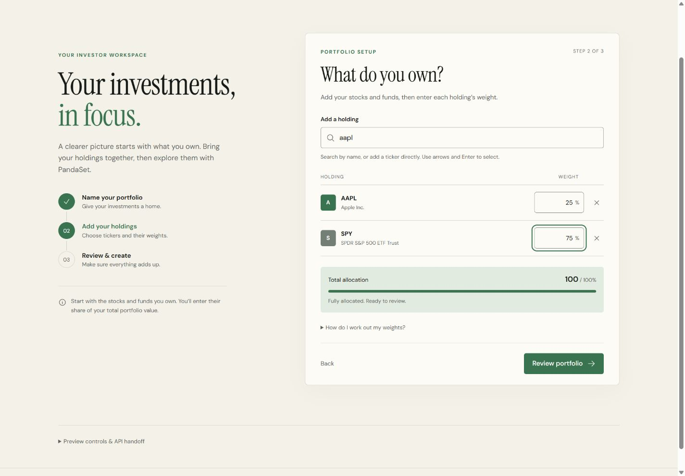
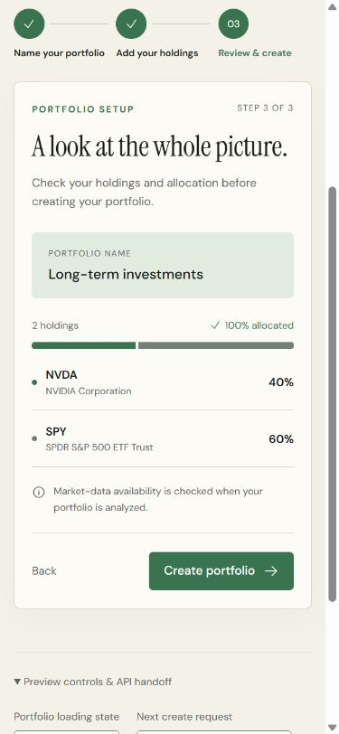

# Standalone portfolio onboarding

The first-portfolio flow is ready for review independently of the dashboard and auth branches. It collects a portfolio name, finds or manually adds tickers, accepts percentage weights, validates the allocation, and passes a typed payload to a supplied creation callback.

## Try it locally

From the repository root:

```sh
npm install
npm run dev
```

Open `/onboarding.html` on the Vite URL, for example `http://localhost:5173/onboarding.html`.

This development preview uses a small sample ticker catalog and in-memory creation responses. It makes **no portfolio API requests** and does not persist entries. Expand **Preview controls & API handoff** to inspect the exact payload and exercise loading, search failure, slow creation, or a failed creation followed by retry.

The preview is a separate Vite development entry. It is not added to the production build or the existing dashboard route. `App.tsx`, shared API functions, auth, and backend files are unchanged.

## Component contract

Import `PortfolioOnboarding` from `frontend/src/components/onboarding/PortfolioOnboarding.tsx`. It imports its own scoped stylesheet and uses the existing global styles, fonts, and design tokens.

| Prop                                 | Responsibility                                                                                      |
| ------------------------------------ | --------------------------------------------------------------------------------------------------- |
| `loadState`                          | `loading`, `error`, or `empty` (default). The parent determines whether an investor has portfolios. |
| `onRetryLoad`                        | Parent callback for retrying retrieval; provide it with the error state.                            |
| `searchTickers(query, { signal })`   | Return a promise of `{ symbol, name? }[]`. The parent supplies the search provider.                 |
| `createPortfolio(input, { signal })` | Create a portfolio and return the existing `Portfolio` type. Reject on failure.                     |
| `onOpenPortfolio(portfolio)`         | Select the successfully created portfolio and continue the dashboard lifecycle.                     |
| `onCancel`                           | Optional return-to-portfolios action.                                                               |

Keep provider callbacks stable (for example, with `useCallback`). Search is debounced by 250 ms, aborts superseded requests, ignores stale completions, and normalizes/deduplicates up to eight returned results. A correctly formatted ticker can also be entered directly when search has no result or is unavailable. The provider must verify real symbol coverage when analyzing the portfolio.

Creation is explicit: mounting the component, entering holdings, and reviewing do not call the creation callback. Pending creation disables navigation/submission and has an immediate in-flight guard. Unmounting or moving out of the empty state aborts the request; late responses are ignored. Errors keep the draft so the investor can edit or retry.

A client abort cannot undo a server write that already completed. The eventual API adapter should handle ambiguous network failures and server-side idempotency before automatically retrying creation; the component does not automatically retry.

## API handoff

UI weights are percentages; API weights are fractions:

```json
{
  "name": "Long-term investments",
  "holdings": [
    { "symbol": "AAPL", "weight": 0.25 },
    { "symbol": "SPY", "weight": 0.75 }
  ]
}
```

The payload uses the existing `PortfolioInput` type and matches the current `POST /api/v1/portfolios` body. The callback returns `Portfolio`, including `portfolio_id`, `name`, `holdings`, and `created_at`. No analysis is created by this component.

When integration is ready, the parent supplies callbacks in this shape:

```tsx
<PortfolioOnboarding
  key={user.id}
  loadState={portfolioLoadState}
  onRetryLoad={reloadPortfolios}
  searchTickers={searchTickers}
  createPortfolio={createPortfolio}
  onOpenPortfolio={selectPortfolio}
/>
```

The named callbacks above are integration points, not new exported API functions. The future creation adapter should use the shared API base URL, pass the current Supabase access token, pass the abort signal to fetch, check the HTTP status, and validate the response before resolving.

## Validation

- Name: trimmed, required, at most 100 characters.
- Holdings: 1–100, unique after uppercase/whitespace normalization, matching the current backend ticker syntax (up to 20 characters).
- Weights: strictly above 0% and at most 100%, with up to six decimal places.
- Total: exactly 100%; no automatic redistribution, normalization, or hidden rounding.
- Decimal totals use integer percentage units before conversion to API fractions. `99.999999%` remains invalid rather than displaying as `100%`.
- An incomplete or invalid draft never reaches the creation callback.
- Company names help users choose tickers; they are not sent as part of the holdings payload.

## Follow-up integration ownership

After the auth and portfolio branches merge, coordinate these pieces with their owners:

1. Authenticated portfolio listing and ownership enforcement in the backend.
2. A real ticker search provider and its supported symbol/exchange coverage.
3. The shared authenticated creation adapter and the saved-portfolio response.
4. Parent routing: login → portfolio list/empty state → onboarding → select portfolio → analyze/load the selected portfolio.
5. Dashboard views consuming that same selected portfolio and saved analysis.

Key the component by investor ID and unmount it on sign-out so a draft does not cross accounts. The parent should mount onboarding only for an empty list or an explicit create action. Auth, persistence, portfolio selection, CSV imports, and brokerage connections are outside this change.

## Verification

Automated:

- `npm test`: 26 passing tests, including seven new onboarding validation cases.
- `npm run build`: TypeScript and production build pass. TypeScript also checks the standalone components and preview.

Manually checked in the development preview:

- Desktop at 1440 px; mobile at 390 px and 320 px, without horizontal page overflow.
- Empty/loading/retrieval-error states and retry.
- Blank-name validation, company-name search, keyboard arrows/Enter, Escape, focus after adding, and duplicate protection.
- Under-allocation (95%), over-allocation (105%), and complete allocation (100%).
- Search failure with manual entry, then removal.
- Failed creation preserves entries; retry succeeds; pending buttons are disabled.
- The creation payload converts 25%/75% to 0.25/0.75.
- Success handoff returns the created portfolio; no automatic API call occurs on mount.
- No warning or error messages in the preview's browser console.

Real backend/auth/persistence calls remain an integration check for the next milestone.

## Screenshots

Desktop holdings entry:



Mobile holdings entry:


Mobile review:


