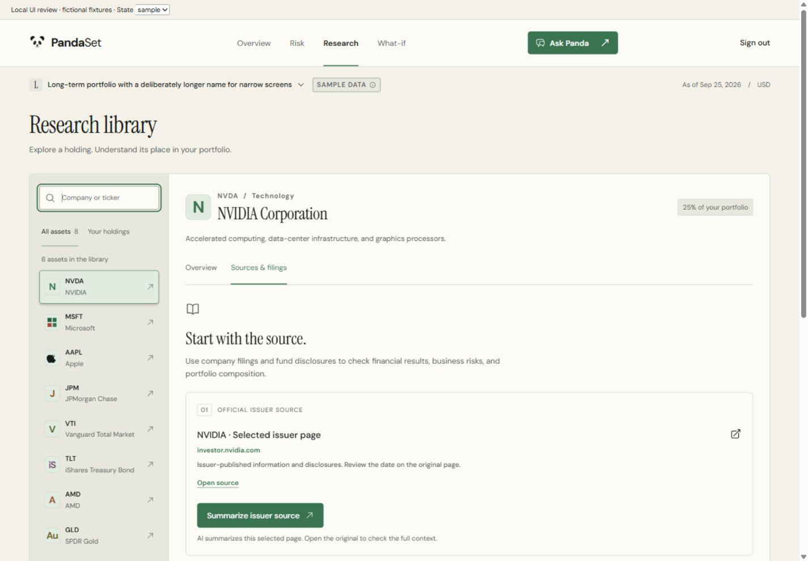
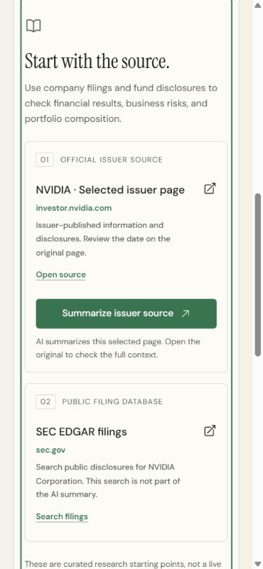

# Research and responsive UI polish

Research now distinguishes a pending request, unavailable history, and an empty or incomplete series. Users can retry a failed request and continue reading issuer sources while prices are unavailable. Sample and vendor history use the response's provenance instead of a fixed demo label; daily vendor history is not described as a real-time quote feed.

## Changes

- Source cards identify the issuer domain, distinguish issuer pages from SEC searches, announce external links, and explain which page the AI summary covers. Existing source URLs and summary callbacks are unchanged.
- Research sections use linked tab panels with Arrow keys, Home, End, and visible keyboard focus. Chart timeline navigation is preserved.
- Search trims surrounding spaces, reports result counts, and provides distinct empty states for no matches and no holdings in the curated library. Unsupported research URLs no longer silently show NVIDIA.
- Invalid or incomplete series are not drawn as charts. Changing tickers retains protection against out-of-order responses.
- Research controls have larger touch targets, source cards wrap on small screens, and narrow charts show fewer date labels while keeping all observations available through the timeline.
- The dashboard header wraps navigation below account actions at tablet widths; long portfolio names wrap without pushing the date or page sideways.

## Integration boundary

The production changes are confined to `Research.tsx`, a dedicated presentation stylesheet, and its stylesheet import. The Research props and existing API calls retain their contracts. App portfolio state, authentication, onboarding, Edit Portfolio, What-if, the API client, backend code, and quant code are untouched.

The library remains a curated set of eight research profiles. Portfolio persistence and support for an expanded research universe belong to the team's integration work.

## Validation

- `npm test`: 42 passing tests, including 10 new Research interaction tests.
- `npm run build`: passed. The existing main-bundle size warning remains.
- Browser checks at 1440, 768, 390, and 320 CSS pixels: no document-level horizontal overflow in the checked Research states.
- Checked loading, request failure and retry, empty history, empty search and reset, source presentation, comparison, keyboard tab navigation, and chart timeline navigation.
- No browser console warnings or errors in the review session.

Visual checks used the actual Research component and dashboard shell markup in a temporary local harness with explicitly labelled fictional fixtures. The harness is not shipped. These checks do not verify authenticated portfolio persistence, real Twelve Data requests, or live Gemini summaries. The callback and network-state behavior is covered by component tests; the integrated authenticated dashboard should receive another smoke check after the team's persistence branch merges.

## Screenshots

Desktop source view:

Mobile source view with keyboard focus:

